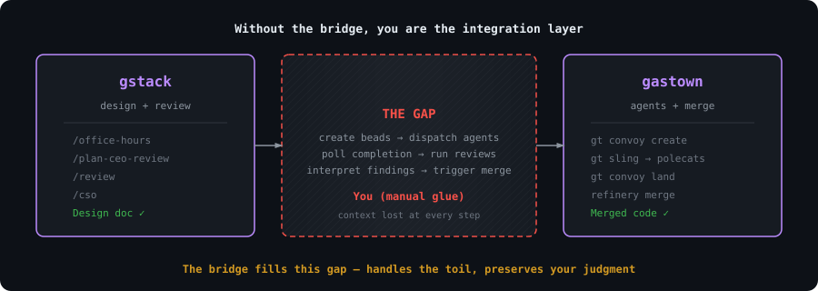
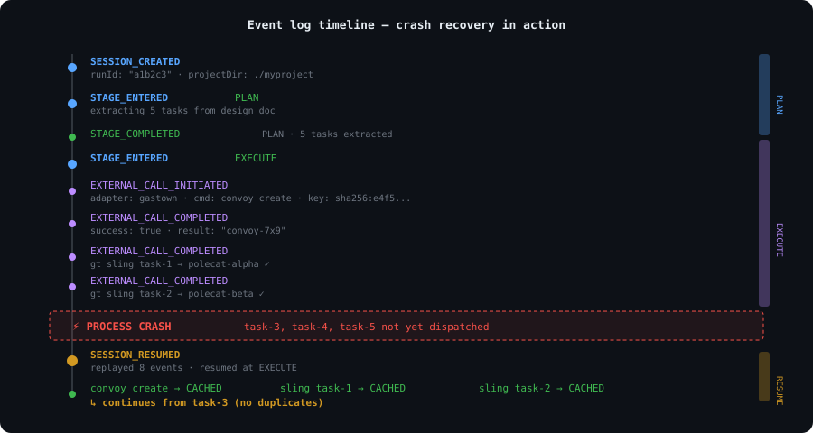
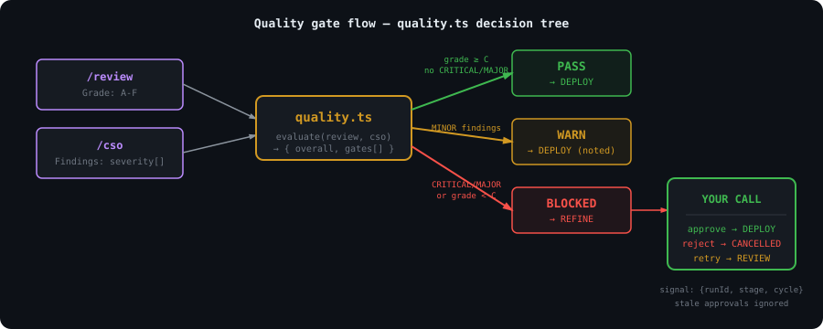
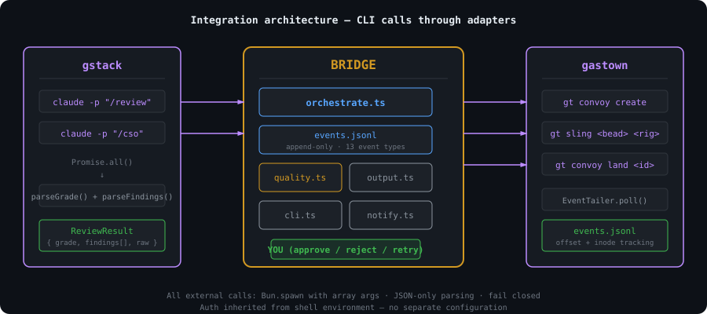

# gastack — the gstack-gastown bridge

> Design doc in, merged code out.

gastack is a continuous verification pipeline that connects [gstack](https://github.com/garrytan/gstack) (AI code review and design tools by [@garrytan](https://github.com/garrytan)) to [Gas Town](https://github.com/24601/gastown) (multi-agent orchestration). Point it at a design doc and a rig. It extracts tasks, dispatches them to AI coding agents, runs code review and security audit in parallel, applies quality gates, blocks when human judgment is needed, and lands through the merge queue.

Seven stages. Crash recovery. Review cycles. One event log. You approve one security finding. That's your only input.

```
Design Doc → PLAN → EXECUTE → REVIEW → REFINE → VERIFY → DEPLOY → DONE
                      ↑          ↑        ↑        ↑
                   gastown     gstack   gstack   canary
               (agent fleet) (review)  (policy)  (health)
```

### The gap the bridge fills



## The sprint

gstack is a process, not a collection of tools. The skills run in the order a sprint runs:

**Think → Plan → Build → Review → Test → Ship → Reflect**

Each skill feeds into the next. `/office-hours` writes a design doc that `/plan-ceo-review` reads. `/plan-eng-review` writes a test plan that `/qa` picks up. `/review` catches bugs that `/ship` verifies are fixed. Nothing falls through the cracks because every step knows what came before it.

| Skill | Your specialist | What they do |
|-------|----------------|--------------|
| `/office-hours` | **YC Office Hours** | Start here. Six forcing questions that reframe your product before you write code. Pushes back on your framing, challenges premises, generates implementation alternatives. Design doc feeds into every downstream skill. |
| `/plan-ceo-review` | **CEO / Founder** | Rethink the problem. Find the 10-star product hiding inside the request. Four modes: Expansion, Selective Expansion, Hold Scope, Reduction. |
| `/plan-eng-review` | **Eng Manager** | Lock in architecture, data flow, diagrams, edge cases, and tests. Forces hidden assumptions into the open. |
| `/plan-design-review` | **Senior Designer** | Rates each design dimension 0-10, explains what a 10 looks like, then edits the plan to get there. AI Slop detection. Interactive — one AskUserQuestion per design choice. |
| `/design-consultation` | **Design Partner** | Build a complete design system from scratch. Researches the landscape, proposes creative risks, generates realistic product mockups. |
| `/review` | **Staff Engineer** | Find the bugs that pass CI but blow up in production. Auto-fixes the obvious ones. Flags completeness gaps. |
| `/investigate` | **Debugger** | Systematic root-cause debugging. Iron Law: no fixes without investigation. Traces data flow, tests hypotheses, stops after 3 failed fixes. |
| `/design-review` | **Designer Who Codes** | Same audit as /plan-design-review, then fixes what it finds. Atomic commits, before/after screenshots. |
| `/design-shotgun` | **Design Explorer** | Generate multiple AI design variants, open a comparison board in your browser, and iterate until you approve a direction. Taste memory biases toward your preferences. |
| `/design-html` | **Design Engineer** | Generates production-quality HTML with Pretext for computed text layout. Works with approved mockups, CEO plans, design reviews, or from scratch. Text reflows on resize, heights adjust to content. Smart API routing picks the right Pretext patterns per design type. Framework detection for React/Svelte/Vue. |
| `/qa` | **QA Lead** | Test your app, find bugs, fix them with atomic commits, re-verify. Auto-generates regression tests for every fix. |
| `/qa-only` | **QA Reporter** | Same methodology as /qa but report only. Pure bug report without code changes. |
| `/cso` | **Chief Security Officer** | OWASP Top 10 + STRIDE threat model. Zero-noise: 17 false positive exclusions, 8/10+ confidence gate, independent finding verification. Each finding includes a concrete exploit scenario. |
| `/ship` | **Release Engineer** | Sync main, run tests, audit coverage, push, open PR. Bootstraps test frameworks if you don't have one. |
| `/land-and-deploy` | **Release Engineer** | Merge the PR, wait for CI and deploy, verify production health. One command from "approved" to "verified in production." |
| `/canary` | **SRE** | Post-deploy monitoring loop. Watches for console errors, performance regressions, and page failures. |
| `/benchmark` | **Performance Engineer** | Baseline page load times, Core Web Vitals, and resource sizes. Compare before/after on every PR. |
| `/document-release` | **Technical Writer** | Update all project docs to match what you just shipped. Catches stale READMEs automatically. |
| `/retro` | **Eng Manager** | Team-aware weekly retro. Per-person breakdowns, shipping streaks, test health trends, growth opportunities. `/retro global` runs across all your projects and AI tools (Claude Code, Codex, Gemini). |
| `/browse` | **QA Engineer** | Give the agent eyes. Real Chromium browser, real clicks, real screenshots. ~100ms per command. `$B connect` launches your real Chrome as a headed window — watch every action live. |
| `/setup-browser-cookies` | **Session Manager** | Import cookies from your real browser (Chrome, Arc, Brave, Edge) into the headless session. Test authenticated pages. |
| `/autoplan` | **Review Pipeline** | One command, fully reviewed plan. Runs CEO → design → eng review automatically with encoded decision principles. Surfaces only taste decisions for your approval. |
| `/learn` | **Memory** | Manage what gstack learned across sessions. Review, search, prune, and export project-specific patterns, pitfalls, and preferences. Learnings compound across sessions so gstack gets smarter on your codebase over time. |
| `/checkpoint` | **Session Snapshot** | Save and resume working state. Captures git state, decisions made, remaining work. Survives context compaction. Cross-branch listing for multi-agent handoff. |
| `/health` | **Code Quality** | Scorekeeper for your codebase. Wraps your tools (tsc, biome, knip, shellcheck, tests), computes a 0-10 composite score, tracks trends. When the score drops, tells you exactly what changed. |

### Power tools

| Skill | What it does |
|-------|-------------|
| `/codex` | **Second Opinion** — independent code review from OpenAI Codex CLI. Three modes: review (pass/fail gate), adversarial challenge, and open consultation. Cross-model analysis when both `/review` and `/codex` have run. |
| `/careful` | **Safety Guardrails** — warns before destructive commands (rm -rf, DROP TABLE, force-push). Say "be careful" to activate. Override any warning. |
| `/freeze` | **Edit Lock** — restrict file edits to one directory. Prevents accidental changes outside scope while debugging. |
| `/guard` | **Full Safety** — `/careful` + `/freeze` in one command. Maximum safety for prod work. |
| `/unfreeze` | **Unlock** — remove the `/freeze` boundary. |
| `/connect-chrome` | **Chrome Controller** — launch Chrome with the Side Panel extension. Watch every action live, inspect CSS on any element, clean up pages, and take screenshots. Each tab gets its own agent. |
| `/setup-deploy` | **Deploy Configurator** — one-time setup for `/land-and-deploy`. Detects your platform, production URL, and deploy commands. |
| `/gstack-upgrade` | **Self-Updater** — upgrade gstack to latest. Detects global vs vendored install, syncs both, shows what changed. |

**[Deep dives with examples and philosophy for every skill →](docs/skills.md)**

## Parallel sprints

gstack works well with one sprint. It gets interesting with ten running at once.

**Design is at the heart.** `/design-consultation` builds your design system from scratch, researches the space, proposes creative risks, and writes `DESIGN.md`. `/design-shotgun` generates multiple visual variants and opens a comparison board so you can pick a direction. `/design-html` takes that approved mockup and generates production-quality HTML with Pretext, where text actually reflows on resize instead of breaking with hardcoded heights. Then `/design-review` and `/plan-eng-review` read what you chose. Design decisions flow through the whole system.

**`/qa` was a massive unlock.** It let me go from 6 to 12 parallel workers. Claude Code saying *"I SEE THE ISSUE"* and then actually fixing it, generating a regression test, and verifying the fix — that changed how I work. The agent has eyes now.

**Smart review routing.** Just like at a well-run startup: CEO doesn't have to look at infra bug fixes, design review isn't needed for backend changes. gstack tracks what reviews are run, figures out what's appropriate, and just does the smart thing. The Review Readiness Dashboard tells you where you stand before you ship.

**Test everything.** `/ship` bootstraps test frameworks from scratch if your project doesn't have one. Every `/ship` run produces a coverage audit. Every `/qa` bug fix generates a regression test. 100% test coverage is the goal — tests make vibe coding safe instead of yolo coding.

**`/document-release` is the engineer you never had.** It reads every doc file in your project, cross-references the diff, and updates everything that drifted. README, ARCHITECTURE, CONTRIBUTING, CLAUDE.md, TODOS — all kept current automatically. And now `/ship` auto-invokes it — docs stay current without an extra command.

**Real browser mode.** `$B connect` launches your actual Chrome as a headed window controlled by Playwright. You watch Claude click, fill, and navigate in real time — same window, same screen. A subtle green shimmer at the top edge tells you which Chrome window gstack controls. All existing browse commands work unchanged. `$B disconnect` returns to headless. A Chrome extension Side Panel shows a live activity feed of every command and a chat sidebar where you can direct Claude. This is co-presence — Claude isn't remote-controlling a hidden browser, it's sitting next to you in the same cockpit.

**Sidebar agent — your AI browser assistant.** Type natural language instructions in the Chrome side panel and a child Claude instance executes them. "Navigate to the settings page and screenshot it." "Fill out this form with test data." "Go through every item in this list and extract the prices." Each task gets up to 5 minutes. The sidebar agent runs in an isolated session, so it won't interfere with your main Claude Code window. It's like having a second pair of hands in the browser.

**Personal automation.** The sidebar agent isn't just for dev workflows. Example: "Browse my kid's school parent portal and add all the other parents' names, phone numbers, and photos to my Google Contacts." Two ways to get authenticated: (1) log in once in the headed browser — your session persists, or (2) run `/setup-browser-cookies` to import cookies from your real Chrome. Once authenticated, Claude navigates the directory, extracts the data, and creates the contacts.

**Browser handoff when the AI gets stuck.** Hit a CAPTCHA, auth wall, or MFA prompt? `$B handoff` opens a visible Chrome at the exact same page with all your cookies and tabs intact. Solve the problem, tell Claude you're done, `$B resume` picks up right where it left off. The agent even suggests it automatically after 3 consecutive failures.

**Multi-AI second opinion.** `/codex` gets an independent review from OpenAI's Codex CLI — a completely different AI looking at the same diff. Three modes: code review with a pass/fail gate, adversarial challenge that actively tries to break your code, and open consultation with session continuity. When both `/review` (Claude) and `/codex` (OpenAI) have reviewed the same branch, you get a cross-model analysis showing which findings overlap and which are unique to each.

**Safety guardrails on demand.** Say "be careful" and `/careful` warns before any destructive command — rm -rf, DROP TABLE, force-push, git reset --hard. `/freeze` locks edits to one directory while debugging so Claude can't accidentally "fix" unrelated code. `/guard` activates both. `/investigate` auto-freezes to the module being investigated.

**Proactive skill suggestions.** gstack notices what stage you're in — brainstorming, reviewing, debugging, testing — and suggests the right skill. Don't like it? Say "stop suggesting" and it remembers across sessions.

## 10-15 parallel sprints

gstack is powerful with one sprint. It is transformative with ten running at once.

[Conductor](https://conductor.build) runs multiple Claude Code sessions in parallel — each in its own isolated workspace. One session running `/office-hours` on a new idea, another doing `/review` on a PR, a third implementing a feature, a fourth running `/qa` on staging, and six more on other branches. All at the same time. I regularly run 10-15 parallel sprints — that's the practical max right now.

The sprint structure is what makes parallelism work. Without a process, ten agents is ten sources of chaos. With a process — think, plan, build, review, test, ship — each agent knows exactly what to do and when to stop. You manage them the way a CEO manages a team: check in on the decisions that matter, let the rest run.

---

## Find your entry point

### I use gstack already

The bridge automates everything after `/plan-ceo-review` approves your design. Instead of manually creating work items, dispatching agents, running `/review` and `/cso`, interpreting findings, and triggering merges — the bridge does it as a single pipeline. Your gstack skills become quality gates in an automated flow.

**[Jump to install →](#install)**

### I use Gas Town already

The bridge feeds gstack's `/review` and `/cso` quality gates into your convoy/polecat workflow. Instead of dispatching work and hoping it's correct, every task goes through structured code review and security audit before landing. Quality policy decides what passes, what warns, and what blocks for human approval.

**[Jump to install →](#install)**

### What is gstack?

[gstack](https://github.com/garrytan/gstack) by Garry Tan turns Claude Code into a virtual engineering team — 20+ slash-command specialists covering design, review, QA, security, and shipping. `/review` finds production bugs, `/cso` runs OWASP + STRIDE security audits, `/ship` handles the release. The bridge uses `/review` and `/cso` as its quality gates.

### What is Gas Town?

[Gas Town](https://github.com/24601/gastown) is a multi-agent workspace manager. It runs fleets of AI coding agents (polecats) coordinated by crew workers, with a witness for lifecycle management and a refinery for merge queues. The bridge uses Gas Town's convoy system to dispatch tasks and land merged code.

---

## The problem we solve

Without the bridge, you are the integration layer:

| Step | Without bridge | With bridge |
|------|---------------|-------------|
| Read design doc, extract tasks | Manual | `PLAN` stage (regex + LLM) |
| Create beads, dispatch to agents | Manual (`bd new`, `gt sling` × N) | `EXECUTE` stage (priority-ordered batch) |
| Wait for completion, run reviews | Manual (`claude -p /review`, `/cso`) | `REVIEW` stage (parallel, multi-model, iterates) |
| Interpret findings, decide action | Manual | `quality.ts` policy engine with reconciliation |
| Approve blocking findings | Manual | `REFINE` stage (scoped signals) |
| Verify production health | Manual (open browser, click around) | `VERIFY` stage (canary health checks) |
| Trigger merge | Manual (`gt convoy land`) | `DEPLOY` stage (merge queue) |

Every manual step loses context and invites shortcuts. The bridge replaces you as the router.

---

## Install

**Prerequisites:** [gstack](https://github.com/garrytan/gstack) installed (`claude` on PATH), [Gas Town](https://github.com/24601/gastown) installed (`gt` and `bd` on PATH), [Bun](https://bun.sh/) v1.0+

### Option A: Use this fork (recommended)

If you want gstack + bridge together. All upstream gstack skills work unchanged.

```bash
# Replace your gstack install with this fork
git clone https://github.com/24601/gastack.git ~/.claude/skills/gstack
cd ~/.claude/skills/gstack && ./setup
```

To stay current with upstream gstack:
```bash
cd ~/.claude/skills/gstack
git fetch upstream   # upstream = garrytan/gstack (auto-configured)
git merge upstream/main
```

### Option B: Add bridge to existing gstack (standalone)

If you want to keep garrytan/gstack untouched and add bridge separately.

```bash
# Clone just the bridge (zero npm dependencies, runs on Bun builtins)
git clone --depth 1 https://github.com/24601/gastack.git /tmp/gastack-bridge
cp -r /tmp/gastack-bridge/bridge ~/gstack-bridge
cd ~/gstack-bridge

# Run it
bun run cli.ts start --design-doc <path> --rig <name>
```

The bridge has **zero dependencies on parent gstack code** — all imports are internal (`./events.js`, `./orchestrate.js`) or Node builtins (`fs`, `path`, `crypto`). It shells out to `claude` and `gt` CLIs, which must be on your PATH.

---

## Quick start — slash commands (recommended)

The fastest way to use the bridge is through three gstack slash commands.
No CLI flags to remember — gastown feels like part of gstack:

```bash
# Dispatch a design doc to gastown polecats
/dispatch docs/designs/auth-system.md

# Monitor convoy progress, find stranded work
/convoy-status

# Collect results, run quality gates, merge
/collect
```

That's it. `/dispatch` breaks your plan into tasks, creates beads, dispatches
a convoy. `/collect` runs the Review Army (7 specialists), CSO security scan,
health check, and merges via pre-verified fast-path when everything passes.

## Quick start — CLI (advanced)

```bash
# Start a pipeline from a design doc
bun run bridge/cli.ts start --design-doc ~/.gstack/projects/my-design.md --rig myproject

# Watch events in real time
bun run bridge/cli.ts watch <run-id>

# Check pipeline status
bun run bridge/cli.ts status <run-id>

# Approve a blocked finding
bun run bridge/cli.ts approve <run-id> --stage REVIEW --cycle 1 --reason "accepted risk"

# Reject (cancel the run)
bun run bridge/cli.ts reject <run-id> --stage REVIEW --cycle 1 --reason "fix needed"

# List all sessions
bun run bridge/cli.ts list
```

---

## How it works

### The stage machine

| Stage | What happens | External calls |
|-------|-------------|----------------|
| **PLAN** | Extract tasks from design doc (regex + Haiku LLM) | — |
| **EXECUTE** | Create convoy, dispatch tasks to polecats (priority-ordered) | `gt convoy create`, `gt sling` × N |
| **REVIEW** | Run code review + security audit in parallel; iterates review cycles until clean | `claude -p /review`, `claude -p /cso` |
| **REFINE** | Quality gate evaluation → PASS / WARN / BLOCKED | Human approval if blocked |
| **VERIFY** | Post-merge canary check — monitors production health | Browse daemon health checks |
| **DEPLOY** | Land through refinery merge queue | `gt convoy land` |
| **DONE** | Pipeline complete | — |

### Event-sourced state

The orchestrator has zero mutable state fields. Everything is derived from an append-only JSONL event log at `~/.gstack/runs/{id}/events.jsonl`. On crash, `Orchestrator.resume()` replays the log and reconstructs the current stage, pending tasks, and completed work.

Every external call gets an idempotency token (SHA-256 of adapter + command + args) written to the log before the result is processed. On restart, completed calls return cached results — no duplicate convoys, reviews, or merges.



### Quality policy

| Gate | PASS | WARN | BLOCKED |
|------|------|------|---------|
| Security (`/cso`) | No findings | MINOR severity | CRITICAL or MAJOR |
| Correctness (`/review`) | Grade ≥ C | Minor findings | Grade < C or not run |

Security CRITICAL+ requires explicit human approval with a reason. The bridge fail-closes: if `gt --json` returns non-JSON, it blocks. No text scraping as fallback.



---

## Architecture



~6K lines source + ~8K lines tests. Zero npm dependencies.

```
bridge/
├── orchestrate.ts        1480 lines — stage machine, review cycles, state derivation
├── events.ts              462 lines — 13-event schema, JSONL log, idempotency
├── cli.ts                 656 lines — start, status, watch, approve, reject
├── quality.ts             946 lines — quality policy engine, multi-model reconciliation
├── output.ts              360 lines — adaptive output calibration
├── notify.ts              354 lines — Slack/Discord webhooks
├── dispatch.ts            157 lines — priority-ordered batch dispatch
├── stranded.ts            272 lines — stranded convoy diagnosis
├── task-extract.ts         98 lines — design doc → task extraction
├── adapters/
│   ├── gastown.ts         681 lines — gt CLI wrapper, review routing, event tailer
│   └── gstack.ts          412 lines — claude -p executor, grade/finding parsers
└── test/                 8K+ lines — tests for every module
```

### Key engineering decisions

1. **Event log IS the state.** No checkpoint file. Crash → replay JSONL → reconstruct.
2. **Idempotent external calls.** SHA-256 content addressing. Written before result processing.
3. **Scoped approval signals.** `{runId, stage, reviewCycle}` — stale approvals from previous cycles are ignored.
4. **Array args everywhere.** `Bun.spawn(['gt', 'sling', beadId])` — no shell interpolation, no injection.
5. **Adaptive output.** First run: verbose. Run 10+: terse. `--verbose`/`--quiet` override.
6. **Review cycles.** Review → fix → re-review iterates until clean or max cycles reached. Each cycle gets its own scoped approval context.
7. **Multi-model dispatch.** Reviews dispatched to multiple models with verdict reconciliation — disagreements surface for human judgment.
8. **Smart review routing.** Security-sensitive paths get full /cso + /review. Infra-only changes skip design review. The decision tree routes like a well-run startup.

---

## Upstream sync

This fork tracks [garrytan/gstack](https://github.com/garrytan/gstack) upstream. The `bridge/` directory is our only addition — it doesn't touch any upstream files.

**For fork users — staying current:**
```bash
cd ~/.claude/skills/gstack    # or wherever you cloned gastack
git remote add upstream https://github.com/garrytan/gstack.git  # one-time
git fetch upstream
git merge upstream/main       # bridge/ won't conflict — it's a new directory
git push
```

**For contributors:** PRs that touch only `bridge/` go here. PRs that touch upstream gstack code should go to [garrytan/gstack](https://github.com/garrytan/gstack).

---

## Roadmap

- **Phase B1 (shipped):** Bun-only spike. Local daemon. Terminal UI. Event-sourced state. Crash recovery.
- **Phase B2 (current):** Review cycles, multi-model dispatch, smart review routing, VERIFY stage, session death handling, stranded convoy diagnosis. Production-grade pipeline.
- **Phase B3:** Temporal migration. Durable workflow state. Multi-machine resume.
- **Phase C:** Extensible policy engine. Custom stage definitions. Plugin adapters.

---

## Attribution

This fork adds the gstack-gastown bridge. All gstack skills, the browse binary, the design tools, and the Chrome extension are by [@garrytan](https://github.com/garrytan) and the gstack community. We build on top of their work.

- **gstack:** [github.com/garrytan/gstack](https://github.com/garrytan/gstack) — MIT licensed
- **Gas Town:** [github.com/24601/gastown](https://github.com/24601/gastown)
- **Bridge:** [github.com/24601/gastack](https://github.com/24601/gastack) — MIT licensed

## License

MIT
